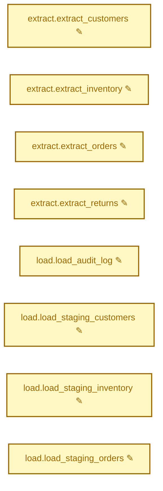
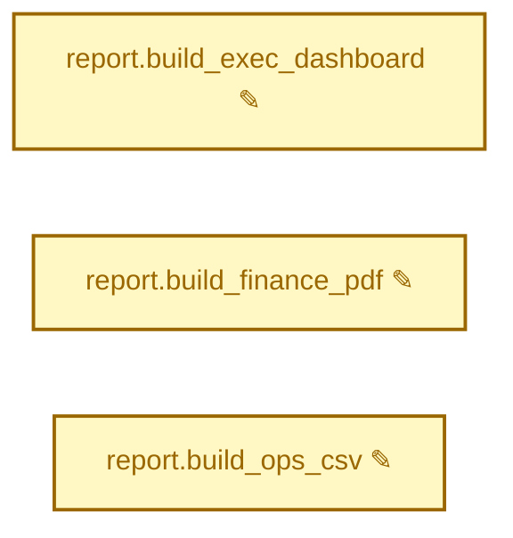
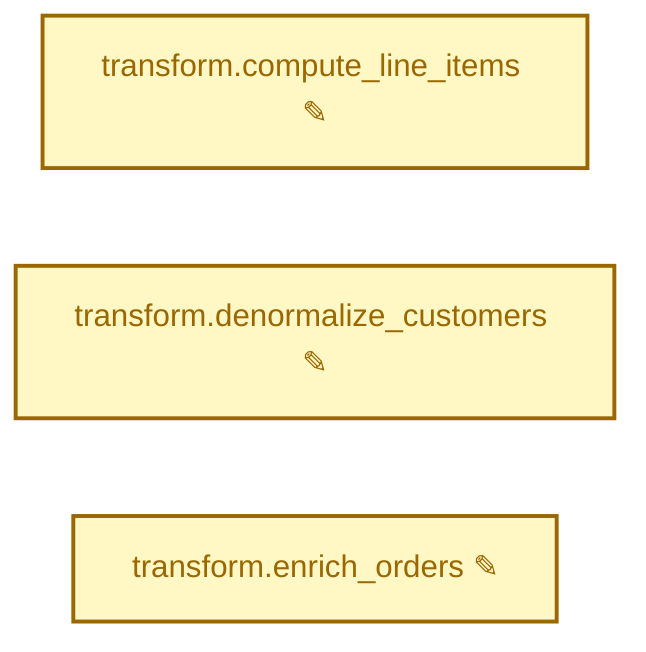

# airflow-diff

Render Apache Airflow 2.x DAGs at two git commits, structurally diff them
(including Jinja-rendered template fields), and emit a GitHub-flavored markdown
PR comment with a Mermaid diff graph, summary table, and collapsible per-field
text diffs.

## Why

When a PR touches a DAG, what GitHub shows you is a textual `git diff` of
Python source. What runs in production is the *imported, template-rendered*
DAG — a different object whose `bash_command`, `sql`, and other operator
parameters may have expanded differently than the source suggests. A change to
a shared helper or factory function can silently mutate dozens of unrelated
DAGs. `airflow-diff` surfaces all of that at PR time.

## See it in action

Three short case studies, each built from the same two Airflow DAGs
(`orders_pipeline` — hourly ingestion; `finance_rollup` — daily aggregations).
The runnable sources live in [`examples/showcase/`](examples/showcase/); run
any case yourself with `examples/showcase/make_history.sh case-N --run`.

### Case 1 — A refactor that silently broke 8 tasks

> A teammate consolidates the staging-bucket prefix into a helper. The
> helper has a typo. `git diff` shows three innocuous lines; production is
> now writing to a bucket that doesn't exist.

What the PR diff shows:

````diff
- BUCKET = Variable.get("warehouse_bucket")
+ from common.buckets import warehouse_prefix
+ BUCKET = warehouse_prefix()
````

<details><summary>What <code>airflow-diff</code> posts on the PR</summary>

<!-- generated by examples/showcase/make_history.sh case-1 --run; refresh when renderer output changes -->
## airflow-diff: 2 DAGs changed (1 incidentally affected)

Base: `6de7f617` → Head: `bd59a55b`
### `orders_pipeline` — 8 tasks modified

| Task | Field | Change |
|------|-------|--------|
| `extract.extract_customers` | `bash_command` | modified |
| `extract.extract_inventory` | `bash_command` | modified |
| `extract.extract_orders` | `bash_command` | modified |
| `extract.extract_returns` | `bash_command` | modified |
| `load.load_audit_log` | `bash_command` | modified |
| `load.load_staging_customers` | `bash_command` | modified |
| `load.load_staging_inventory` | `bash_command` | modified |
| `load.load_staging_orders` | `bash_command` | modified |
<details><summary>orders_pipeline.extract.extract_customers.bash_command</summary>

```diff
- extract.sh customers --date 2025-01-01 --out s3://<VAR:warehouse_bucket>/raw/customers/20250101/
+ extract.sh customers --date 2025-01-01 --out s3://<VAR:warehouse_buckte>/raw/customers/20250101/
```

</details>
<details><summary>orders_pipeline.extract.extract_inventory.bash_command</summary>

```diff
- extract.sh inventory --date 2025-01-01 --out s3://<VAR:warehouse_bucket>/raw/inventory/20250101/
+ extract.sh inventory --date 2025-01-01 --out s3://<VAR:warehouse_buckte>/raw/inventory/20250101/
```

</details>
<details><summary>orders_pipeline.extract.extract_orders.bash_command</summary>

```diff
- extract.sh orders --date 2025-01-01 --out s3://<VAR:warehouse_bucket>/raw/orders/20250101/
+ extract.sh orders --date 2025-01-01 --out s3://<VAR:warehouse_buckte>/raw/orders/20250101/
```

</details>
<details><summary>orders_pipeline.extract.extract_returns.bash_command</summary>

```diff
- extract.sh returns --date 2025-01-01 --out s3://<VAR:warehouse_bucket>/raw/returns/20250101/
+ extract.sh returns --date 2025-01-01 --out s3://<VAR:warehouse_buckte>/raw/returns/20250101/
```

</details>
<details><summary>orders_pipeline.load.load_audit_log.bash_command</summary>

```diff
- load.sh audit --bucket <VAR:warehouse_bucket> --date 2025-01-01
+ load.sh audit --bucket <VAR:warehouse_buckte> --date 2025-01-01
```

</details>
<details><summary>orders_pipeline.load.load_staging_customers.bash_command</summary>

```diff
- load.sh customers --bucket <VAR:warehouse_bucket> --date 2025-01-01
+ load.sh customers --bucket <VAR:warehouse_buckte> --date 2025-01-01
```

</details>
<details><summary>orders_pipeline.load.load_staging_inventory.bash_command</summary>

```diff
- load.sh inventory --bucket <VAR:warehouse_bucket> --date 2025-01-01
+ load.sh inventory --bucket <VAR:warehouse_buckte> --date 2025-01-01
```

</details>
<details><summary>orders_pipeline.load.load_staging_orders.bash_command</summary>

```diff
- load.sh orders --bucket <VAR:warehouse_bucket> --date 2025-01-01
+ load.sh orders --bucket <VAR:warehouse_buckte> --date 2025-01-01
```

</details>
<details><summary>DAGs incidentally affected (not touched by this PR)</summary>

### `finance_rollup` — no structural change

</details>

</details>
Run locally: `examples/showcase/make_history.sh case-1 --run`.

### Case 2 — Schedule drift breaks a cross-DAG sensor

> `orders_pipeline` is rescheduled from `@hourly` to every 4 hours.
> `finance_rollup`'s `ExternalTaskSensor` still expects a 1-hour offset.
> The sensor will hang in production.

What the PR diff shows:

````diff
-    schedule="@hourly",
+    schedule="0 */4 * * *",
````

<details><summary>What <code>airflow-diff</code> posts on the PR</summary>

<!-- generated by examples/showcase/make_history.sh case-2 --run; refresh when renderer output changes -->
## airflow-diff: 2 DAGs changed (1 incidentally affected, **1 cross-DAG mismatch**)

Base: `a3315fbd` → Head: `4a45e864`
## ⚠️ Cross-DAG sensor mismatches (PR-introduced)

This PR introduces 1 `ExternalTaskSensor` configuration that may not align with their upstream targets at runtime.

| Sensor | Target | Issue |
|---|---|---|
| `finance_rollup.wait.wait_for_orders` | `orders_pipeline.publish_orders_ready` | Likely incorrect `execution_delta=3600s` (expected `0s`) |

<details><summary>Details</summary>

**`finance_rollup.wait.wait_for_orders` → `orders_pipeline.publish_orders_ready`**
- Sensor DAG schedule: `0 6 * * *`
- Target DAG schedule: `0 */4 * * *`
- `execution_delta`: `3600s`
- Expected `execution_delta`: `0s`

</details>

### `orders_pipeline` — 1 attr change
| Task | Field | Change |
|------|-------|--------|
| _(DAG-level)_ | `schedule` | modified |
<details><summary>DAGs incidentally affected (not touched by this PR)</summary>

### `finance_rollup` — no structural change

</details>

</details>
Run locally: `examples/showcase/make_history.sh case-2 --run`.

### Case 3 — A shared helper rewrites commands across two DAGs

> A new `build_report_cmd` helper prepends a templated `--tenant` flag
> to every report command. Both DAGs adopt the helper. The PR diff looks
> like routine cleanup; `airflow-diff` surfaces the full set of rendered
> command changes across all affected tasks in one place, so the reviewer
> can verify the helper expands the way it should.

What the PR diff shows:

````diff
+ from common.cmd import build_report_cmd
  ...
- bash_command="report.sh exec_dashboard --out s3://...",
+ bash_command=build_report_cmd("exec_dashboard") + " --out s3://...",
````

<details><summary>What <code>airflow-diff</code> posts on the PR</summary>

<!-- generated by examples/showcase/make_history.sh case-3 --run; refresh when renderer output changes -->
## airflow-diff: 2 DAGs changed

Base: `5dd4c3c8` → Head: `7d76dcda`
### `finance_rollup` — 3 tasks modified

| Task | Field | Change |
|------|-------|--------|
| `report.build_exec_dashboard` | `bash_command` | modified |
| `report.build_finance_pdf` | `bash_command` | modified |
| `report.build_ops_csv` | `bash_command` | modified |
<details><summary>finance_rollup.report.build_exec_dashboard.bash_command</summary>

```diff
- report.sh exec_dashboard --out s3://<VAR:report_bucket>/20250101/exec.html
+ report.sh exec_dashboard --tenant <VAR:tenant_id> --out s3://<VAR:report_bucket>/20250101/exec.html
```

</details>
<details><summary>finance_rollup.report.build_finance_pdf.bash_command</summary>

```diff
- report.sh finance_pdf --out s3://<VAR:report_bucket>/20250101/finance.pdf
+ report.sh finance_pdf --tenant <VAR:tenant_id> --out s3://<VAR:report_bucket>/20250101/finance.pdf
```

</details>
<details><summary>finance_rollup.report.build_ops_csv.bash_command</summary>

```diff
- report.sh ops_csv --out s3://<VAR:report_bucket>/20250101/ops.csv
+ report.sh ops_csv --tenant <VAR:tenant_id> --out s3://<VAR:report_bucket>/20250101/ops.csv
```

</details>
### `orders_pipeline` — 3 tasks modified

| Task | Field | Change |
|------|-------|--------|
| `transform.compute_line_items` | `bash_command` | modified |
| `transform.denormalize_customers` | `bash_command` | modified |
| `transform.enrich_orders` | `bash_command` | modified |
<details><summary>orders_pipeline.transform.compute_line_items.bash_command</summary>

```diff
- transform.sh compute_line_items --warehouse <CONN:warehouse.host> --date 2025-01-01
+ report.sh compute_line_items --tenant <VAR:tenant_id> --warehouse <CONN:warehouse.host> --date 2025-01-01
```

</details>
<details><summary>orders_pipeline.transform.denormalize_customers.bash_command</summary>

```diff
- transform.sh denormalize_customers --warehouse <CONN:warehouse.host> --date 2025-01-01
+ report.sh denormalize_customers --tenant <VAR:tenant_id> --warehouse <CONN:warehouse.host> --date 2025-01-01
```

</details>
<details><summary>orders_pipeline.transform.enrich_orders.bash_command</summary>

```diff
- transform.sh enrich_orders --warehouse <CONN:warehouse.host> --date 2025-01-01
+ report.sh enrich_orders --tenant <VAR:tenant_id> --warehouse <CONN:warehouse.host> --date 2025-01-01
```

</details>

</details>
Run locally: `examples/showcase/make_history.sh case-3 --run`.

## Install

> **Pre-1.0:** `airflow-diff` is not yet published to PyPI and the GitHub
> Action has no released tag. The install snippets and Action `uses:` line
> below describe the intended invocations once `0.1.0` is published; until
> then, install from source (`pip install git+https://github.com/Ghoul-SSZ/airflow-diff`).

```bash
pip install airflow-diff
```

Requires Python 3.10+. The CLI needs `uv` and `git` on PATH; the GitHub Action
additionally needs `gh` (used by the wrapper script to post PR comments).

## Developing

```bash
uv pip install -e ".[dev]"
pre-commit install            # one-time
pytest tests/unit -v
ruff check src/ tests/
mypy
```

Lint, format, and type-check run on every commit via pre-commit; CI runs the
same checks plus integration tests across Python × Airflow combinations.

## CLI usage

```bash
# Render and diff against two commits in the current repo
airflow-diff diff <base-sha> <head-sha>

# Choose an output format
airflow-diff diff <base-sha> <head-sha> --format markdown   # default
airflow-diff diff <base-sha> <head-sha> --format terminal
airflow-diff diff <base-sha> <head-sha> --format html --out report.html

# Re-render an existing diff document
airflow-diff diff <base-sha> <head-sha> --json-out diff.json
airflow-diff report diff.json --format html --out report.html
```

Exit codes: `0` for no regressions; `1` when the PR introduces a DAG-level
regression (a DAG that imported cleanly at base now fails at head, or an added
DAG fails to import). Also `1` for PR-introduced cross-DAG sensor mismatches
when `fail_on_sensor_mismatch = true` is set in `.airflow-diff.toml` (see
[Cross-DAG sensor validation](#cross-dag-sensor-validation) below).

## GitHub Action usage

The Action lives at `action/action.yml`, so reference it with the subdirectory
suffix:

```yaml
- uses: actions/checkout@v4
  with: { fetch-depth: 0 }   # required so the base SHA is reachable
- uses: Ghoul-SSZ/airflow-diff/action@v0.1.0
  with:
    github-token: ${{ secrets.GITHUB_TOKEN }}
```

> The `v0.1.0` tag does not exist yet. Pin to a specific commit SHA
> (`Ghoul-SSZ/airflow-diff/action@<sha>`) until a release is cut. The Action's
> internal `pip install airflow-diff==…` step will also fail until the
> package is published to PyPI.

The Action refuses to run on PRs from forks (it imports arbitrary Python from
both commits, and that is not safe to run on untrusted code).

## Configuration

Optional `.airflow-diff.toml` at repo root:

```toml
dags_folder = "dags"
plugins_folder = "plugins"
fixtures_path = ".airflow-diff/fixtures.yaml"
excluded_files = []           # fnmatch patterns, relative to dags_folder
excluded_dag_ids = []         # fnmatch patterns matched against dag_id
synthetic_logical_date = "2025-01-01T00:00:00+00:00"
render_timeout_seconds = 300
max_tasks_for_graph = 50
fail_on_sensor_mismatch = false  # exit 1 on PR-introduced sensor mismatches
```

`excluded_files` and `excluded_dag_ids` both use `fnmatch`-style shell glob
patterns (`*`, `?`, `[abc]`). `excluded_files` patterns are matched against the
path relative to `dags_folder` (e.g. `"legacy/*"` skips anything under
`dags/legacy/`). `excluded_dag_ids` patterns are matched against `dag_id` (e.g.
`"sandbox_*"`). Excluded entries are skipped at the renderer level — they never
appear in the diff or in sensor-mismatch detection.

Optional `.airflow-diff/fixtures.yaml` to provide real Variables/Connections
that override the synthetic `<VAR:...>` / `<CONN:...>` stubs:

```yaml
variables:
  bucket: "my-prod-bucket"
connections:
  warehouse:
    host: "wh.example.com"
    schema: "analytics"
```

## Cross-DAG sensor validation

When a PR introduces an `ExternalTaskSensor` whose target DAG runs on a
different schedule, the sensor must set either `execution_delta` (a
`timedelta`) or `execution_date_fn` (a callable) so it can align with the
upstream's logical date. Forgetting this is a classic "looked fine in code
review, hangs forever in prod" bug.

`airflow-diff` detects three flavors of PR-introduced mismatch and reports
them above the per-DAG details in the PR comment:

- **`missing_execution_delta`** — schedules differ; sensor has neither
  `execution_delta` nor `execution_date_fn`.
- **`incorrect_execution_delta`** — `execution_delta` is a literal `timedelta`
  but doesn't actually align with the target's cron schedule (verified via
  `croniter` at the synthetic logical date).
- **`dangling_target`** — sensor references a `(dag_id, task_id)` that doesn't
  exist in the head DAG bag.

Only mismatches **introduced by the PR** are reported. A pair already broken
at the base commit is silenced.

By default these are surfaced as warnings in the PR comment and the CLI still
exits `0`. Set `fail_on_sensor_mismatch = true` in `.airflow-diff.toml` to
have CI exit `1` on any PR-introduced mismatch.

## Limitations

- Airflow 2.x only (2.8.x – 2.10.x).
- Linux and macOS only.
- `pip` installs of arbitrary user code happen in isolated venvs but are not
  sandboxed. Do not run against PRs from untrusted forks.
- Code that does real work at module import time (e.g., `Hook.get_records()`
  inside `dags/`) will hit stubs and may crash; the DAG appears as broken.
- Dynamic task mapping (`.expand()`) is captured structurally but not
  unrolled into mapped task instances.
- No rename detection — renamed tasks or DAGs appear as remove + add.

## Releasing

> **One-time PyPI setup.** Before the first tag, configure a Trusted Publisher
> at <https://pypi.org/manage/account/publishing/> with: PyPI project
> `airflow-diff`, owner = this repo's GitHub owner, repository `airflow-diff`,
> workflow `release.yml`, environment `pypi`. Then create a GitHub environment
> named `pypi` under Settings → Environments (reviewers optional). Without
> both, the `publish` job will fail with a 403 from PyPI.

1. Update `airflow_diff.__version__` and move the `## [Unreleased]` block in `CHANGELOG.md` under a new `## [X.Y.Z]` heading.
2. Open a PR titled `release: vX.Y.Z`. Merge it.
3. From `main`, tag and push:
    ```bash
    git tag vX.Y.Z
    git push origin vX.Y.Z
    ```
4. The `release` workflow verifies the tag matches `__version__`, builds, publishes to PyPI via OIDC, and opens a follow-up PR to bump `action/action.yml`'s default.
