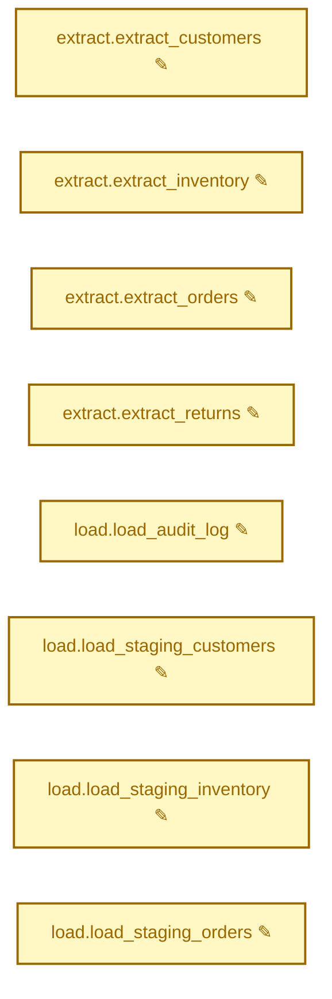

<!-- generated by examples/showcase/make_history.sh case-1 --run; refresh when renderer output changes -->
## airflow-diff: 2 DAGs changed (2 incidentally affected)

Base: `0b4602e2` → Head: `227d1be4`
<details><summary>DAGs incidentally affected (not touched by this PR)</summary>

### `finance_rollup` — no structural change
### `orders_pipeline` — 8 tasks modified

| Task | Field | Change |
|------|-------|--------|
| `extract.extract_customers` | `bash_command` | modified |
| `extract.extract_inventory` | `bash_command` | modified |
| `extract.extract_orders` | `bash_command` | modified |
| `extract.extract_returns` | `bash_command` | modified |
| `load.load_audit_log` | `bash_command` | modified |
| `load.load_staging_customers` | `bash_command` | modified |
| `load.load_staging_inventory` | `bash_command` | modified |
| `load.load_staging_orders` | `bash_command` | modified |
<details><summary>orders_pipeline.extract.extract_customers.bash_command</summary>

```diff
- extract.sh customers --date 2025-01-01 --out s3://<VAR:warehouse_bucket>/raw/customers/20250101/
+ extract.sh customers --date 2025-01-01 --out s3://<VAR:warehouse_buckte>/raw/customers/20250101/
```

</details>
<details><summary>orders_pipeline.extract.extract_inventory.bash_command</summary>

```diff
- extract.sh inventory --date 2025-01-01 --out s3://<VAR:warehouse_bucket>/raw/inventory/20250101/
+ extract.sh inventory --date 2025-01-01 --out s3://<VAR:warehouse_buckte>/raw/inventory/20250101/
```

</details>
<details><summary>orders_pipeline.extract.extract_orders.bash_command</summary>

```diff
- extract.sh orders --date 2025-01-01 --out s3://<VAR:warehouse_bucket>/raw/orders/20250101/
+ extract.sh orders --date 2025-01-01 --out s3://<VAR:warehouse_buckte>/raw/orders/20250101/
```

</details>
<details><summary>orders_pipeline.extract.extract_returns.bash_command</summary>

```diff
- extract.sh returns --date 2025-01-01 --out s3://<VAR:warehouse_bucket>/raw/returns/20250101/
+ extract.sh returns --date 2025-01-01 --out s3://<VAR:warehouse_buckte>/raw/returns/20250101/
```

</details>
<details><summary>orders_pipeline.load.load_audit_log.bash_command</summary>

```diff
- load.sh audit --bucket <VAR:warehouse_bucket> --date 2025-01-01
+ load.sh audit --bucket <VAR:warehouse_buckte> --date 2025-01-01
```

</details>
<details><summary>orders_pipeline.load.load_staging_customers.bash_command</summary>

```diff
- load.sh customers --bucket <VAR:warehouse_bucket> --date 2025-01-01
+ load.sh customers --bucket <VAR:warehouse_buckte> --date 2025-01-01
```

</details>
<details><summary>orders_pipeline.load.load_staging_inventory.bash_command</summary>

```diff
- load.sh inventory --bucket <VAR:warehouse_bucket> --date 2025-01-01
+ load.sh inventory --bucket <VAR:warehouse_buckte> --date 2025-01-01
```

</details>
<details><summary>orders_pipeline.load.load_staging_orders.bash_command</summary>

```diff
- load.sh orders --bucket <VAR:warehouse_bucket> --date 2025-01-01
+ load.sh orders --bucket <VAR:warehouse_buckte> --date 2025-01-01
```

</details>

</details>

