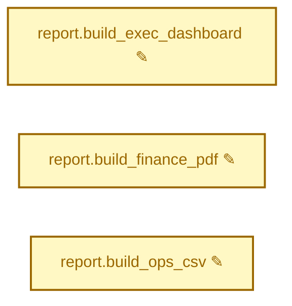
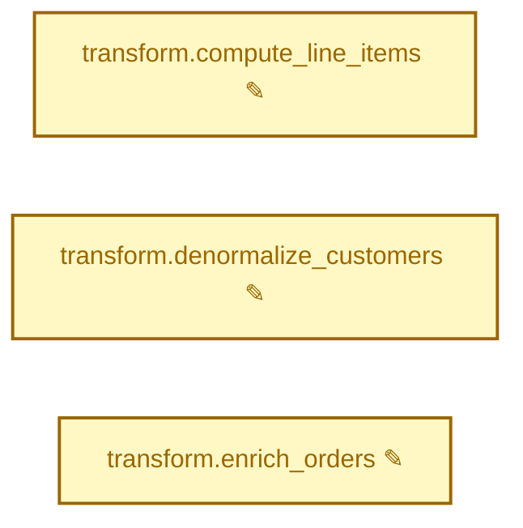

<!-- generated by examples/showcase/make_history.sh case-3 --run; refresh when renderer output changes -->
## airflow-diff: 2 DAGs changed

Base: `5dd4c3c8` → Head: `7d76dcda`
### `finance_rollup` — 3 tasks modified

| Task | Field | Change |
|------|-------|--------|
| `report.build_exec_dashboard` | `bash_command` | modified |
| `report.build_finance_pdf` | `bash_command` | modified |
| `report.build_ops_csv` | `bash_command` | modified |
<details><summary>finance_rollup.report.build_exec_dashboard.bash_command</summary>

```diff
- report.sh exec_dashboard --out s3://<VAR:report_bucket>/20250101/exec.html
+ report.sh exec_dashboard --tenant <VAR:tenant_id> --out s3://<VAR:report_bucket>/20250101/exec.html
```

</details>
<details><summary>finance_rollup.report.build_finance_pdf.bash_command</summary>

```diff
- report.sh finance_pdf --out s3://<VAR:report_bucket>/20250101/finance.pdf
+ report.sh finance_pdf --tenant <VAR:tenant_id> --out s3://<VAR:report_bucket>/20250101/finance.pdf
```

</details>
<details><summary>finance_rollup.report.build_ops_csv.bash_command</summary>

```diff
- report.sh ops_csv --out s3://<VAR:report_bucket>/20250101/ops.csv
+ report.sh ops_csv --tenant <VAR:tenant_id> --out s3://<VAR:report_bucket>/20250101/ops.csv
```

</details>
### `orders_pipeline` — 3 tasks modified

| Task | Field | Change |
|------|-------|--------|
| `transform.compute_line_items` | `bash_command` | modified |
| `transform.denormalize_customers` | `bash_command` | modified |
| `transform.enrich_orders` | `bash_command` | modified |
<details><summary>orders_pipeline.transform.compute_line_items.bash_command</summary>

```diff
- transform.sh compute_line_items --warehouse <CONN:warehouse.host> --date 2025-01-01
+ report.sh compute_line_items --tenant <VAR:tenant_id> --warehouse <CONN:warehouse.host> --date 2025-01-01
```

</details>
<details><summary>orders_pipeline.transform.denormalize_customers.bash_command</summary>

```diff
- transform.sh denormalize_customers --warehouse <CONN:warehouse.host> --date 2025-01-01
+ report.sh denormalize_customers --tenant <VAR:tenant_id> --warehouse <CONN:warehouse.host> --date 2025-01-01
```

</details>
<details><summary>orders_pipeline.transform.enrich_orders.bash_command</summary>

```diff
- transform.sh enrich_orders --warehouse <CONN:warehouse.host> --date 2025-01-01
+ report.sh enrich_orders --tenant <VAR:tenant_id> --warehouse <CONN:warehouse.host> --date 2025-01-01
```

</details>
